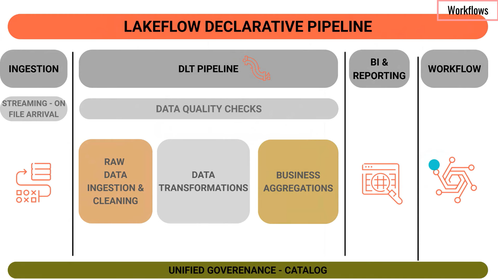
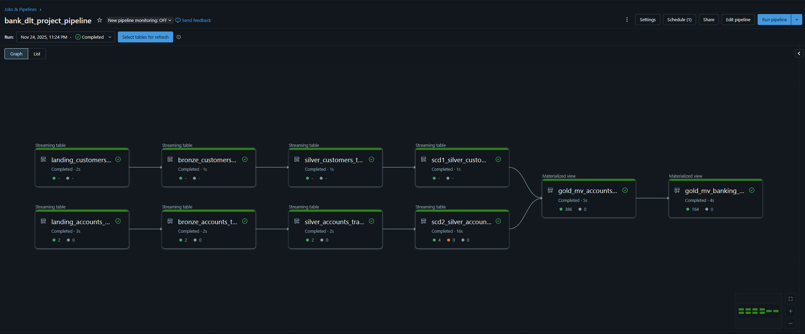
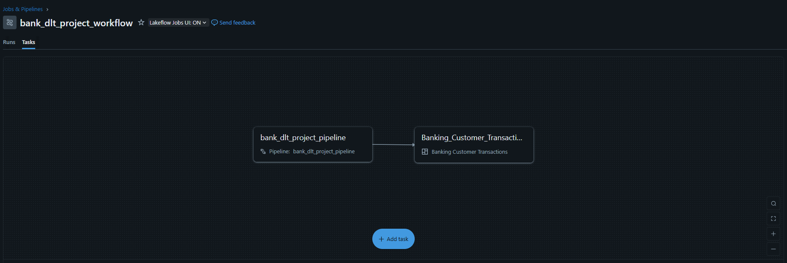

# 💳 Databricks LakeFlow Declarative Pipelines — Banking Analytics Project

This repository showcases a complete **end-to-end Banking Analytics pipeline** built using **Databricks LakeFlow Declarative Pipelines (DLT)** and **Workflows**, following the modern Lakehouse Medallion Architecture.

The project demonstrates how to design a **reliable, declarative, and production-ready ETL pipeline** that ingests banking customer & account transaction data, processes it using DLT, and powers BI dashboards through Gold-layer materialized views.

---

## 🏗️ LakeFlow Architecture



assets/architechure.png

This architecture outlines the full lifecycle:

- **Auto Loader ingestion** (Landing zone)
- **DLT pipeline** handling Bronze → Silver → Gold transformations
- **Data quality enforcement** through expectations
- **Business aggregations** for analytics
- **Dashboard consumption**
- **Workflow-based orchestration**
- **Unified governance with Unity Catalog**

---

### 🔄 LakeFlow Declarative Architecture (Streaming + Materialized Views)

This pipeline combines **continuous streaming ingestion** and **incremental transformations** with optimized **materialized views**:

- **Streaming Tables (Landing → Bronze → Silver):**  
  All early-stage transformations use `spark.readStream` and DLT streaming tables, enabling the pipeline to automatically process new files as they arrive.

- **Materialized Views (Gold Layer):**  
  The Gold layer is built using DLT Materialized Views, which maintain pre-aggregated, analytics-ready datasets that refresh efficiently as upstream streaming tables update.

This design ensures high freshness, low latency, and strong reliability from raw data → business insights.

---

## 🚀 Project Overview

This project simulates a banking data engineering workflow using:

- **Streaming ingestion** of customer & transaction files  
- **Cleansing & validation** using expectations  
- **Transformations & derived attributes** (age, tenure, transaction granularity)  
- **SCD Type-1 and Type-2** processing for historical tracking  
- **Business reporting layer** via **materialized views**  
- **Automated orchestration** through **Workflows**  
- **Interactive analytics** via Databricks AI/BI Dashboard  

This project uses a fully streaming Lakehouse pipeline where:

- **Landing Layer → Streaming Tables (Auto Loader)**
- **Bronze Layer → Streaming Tables**
- **Silver Layer → Streaming Tables**
- **Gold Layer → Materialized Views (MV)**

All transformations up to Gold run incrementally using **DLT Streaming Tables**, ensuring the pipeline remains live, scalable, and ready for near–real-time analytics. The Gold layer uses **DLT Materialized Views**, optimized for BI consumption and dashboard performance.


---

## 🧰 Tech Stack

| Layer | Technology |
|-------|------------|
| Ingestion | Databricks Auto Loader |
| Processing | LakeFlow — Delta Live Tables (DLT) |
| Storage | Databricks Volumes / ADLS (Delta Lake) |
| Governance | Unity Catalog |
| Orchestration | Databricks Workflows |
| BI Reporting | Databricks AI/BI Dashboard |

---

## 🗂️ Dataset Description

The project uses a synthetic banking dataset containing:

- **Customers** — demographics, join date, risk profiles  
- **Accounts Transactions** — credits, debits, balances, channels  

Files are incrementally ingested using **Auto Loader** and processed through the DLT pipeline.

---

## 🪜 Lakehouse Medallion Architecture (Streaming + MVs)

### 🥉 Bronze — *Streaming Table*
- Ingested via Auto Loader (`cloudFiles`)
- Continuous streaming updates
- Expectations applied on-the-fly

### 🥈 Silver — *Streaming Table*
- Live transformations (age, demographics, transaction derivations)
- SCD Type-1 and Type-2 processed incrementally
- Built on top of continuous Bronze output

### 🥇 Gold — *Materialized Views (MV)*
- Pre-aggregated customer and transaction metrics
- Optimized for BI dashboards
- Automatically refreshed as upstream Streaming Tables update

---

> ⭐ **Pipeline Design Summary**  
> - **Landing = Streaming Table (Auto Loader)**  
> - **Bronze = Streaming Table**  
> - **Silver = Streaming Table**  
> - **Gold = Materialized Views (MV)**  
>
> This ensures your pipeline is **fully incremental** from raw ingestion to business reporting.

---

## 🔄 DLT Pipeline Lineage

Here is the exact pipeline executed on Databricks:



The lineage shows:

- **Incremental streaming ingestion**  
- **Bronze → Silver → SCD1/SCD2 → Gold**  
- **Materialized views powering dashboards**  

---

## ⚙️ Workflow Automation

End-to-end orchestration is implemented using **Databricks Workflows**:



The workflow ensures:

1. **DLT pipeline refresh**  
2. **Materialized views rebuild**  
3. **Dashboard auto-refresh**  

This creates a production-style continuous data pipeline.

---

## 📊 Banking Analytics Dashboard

The final BI layer is built using **Databricks AI/BI Dashboard**, visualizing:

- Total customers  
- Account counts  
- Total transactions  
- Total credit / debit / balance amounts  
- Transaction distribution by channel  
- Day-wise/month-wise financial trends  
- Risk segment analysis  
- Customer-level drilldowns  


---

## 📁 Repository Structure

```text
databricks-declarative-pipelines-banking-project/
│
├── assets/                                   # Architecture, pipeline & dashboard screenshots
│   ├── architechure.png
│   ├── bank_dlt_project_pipeline.png
│   ├── bank_dlt_project_workflow.png
│   └── Bank Transaction Dashboard.png
│
├── 00_landing_layer.py                        # Auto Loader + Landing DLT tables
├── 01_bronze_layer.py                         # Bronze cleansing logic + expectations
├── 02_silver_layer.py                         # Silver transformations
├── 02_silver_scd_layer.py                     # SCD Type-1 & Type-2 logic
├── 03_gold_layer.py                           # Gold materialized views & aggregations
│
├── scd_adhoc_analysis.ipynb                   # Exploratory SCD analysis (not used in pipeline)
│
└── README.md
